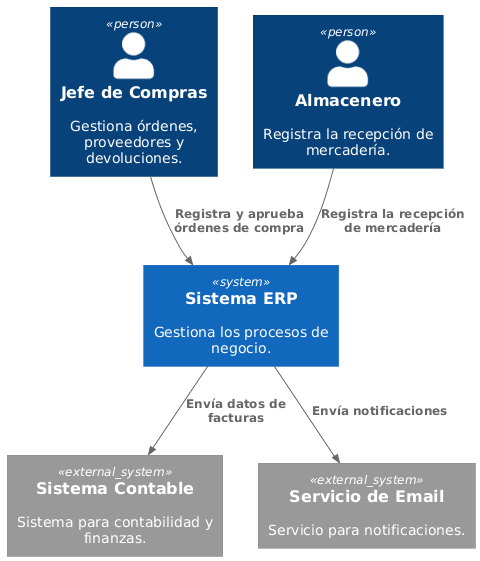
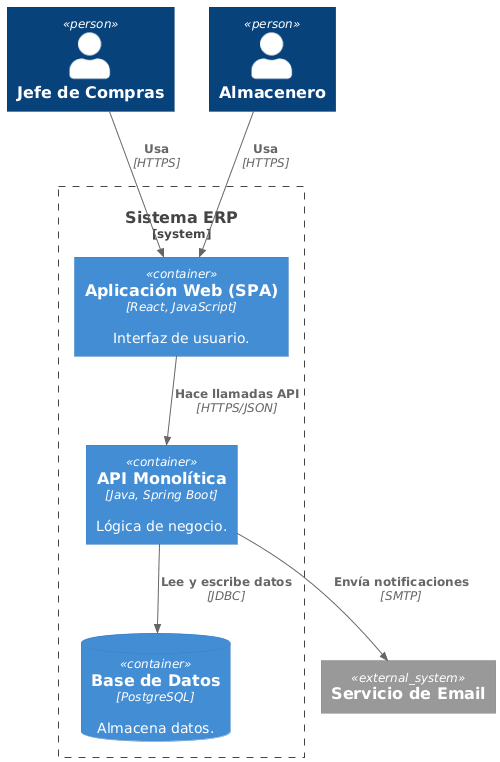
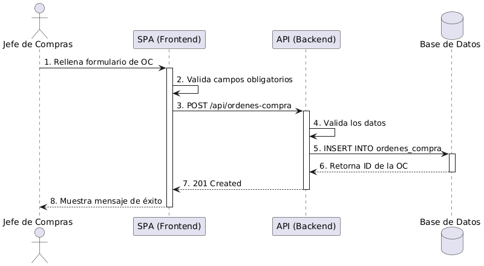

# 

**Acerca de arc42**

arc42, La plantilla de documentación para arquitectura de sistemas y de
software.

Por Dr. Gernot Starke, Dr. Peter Hruschka y otros contribuyentes.

Revisión de la plantilla: 7.0 ES (basada en asciidoc), Enero 2017

© Reconocemos que este documento utiliza material de la plantilla de
arquitectura arc42, <https://www.arc42.org>. Creada por Dr. Peter
Hruschka y Dr. Gernot Starke.

# Introducción y Metas {#section-introduction-and-goals} 

El sistema ERP tiene como objetivo centralizar y automatizar los procesos de negocio de la empresa, comenzando por el módulo de compras.

## Vista de Requerimientos {#_vista_de_requerimientos} 

### Requisitos de Negocio - Módulo de Compras:

1. **Registrar Orden de Compra**: Permitir al Jefe de Compras crear órdenes con proveedores, productos y precios.
2. **Aprobar Orden de Compra**: Autorizar órdenes pendientes y bloquear su edición.
3. **Consultar Proveedores**: Buscar proveedores por nombre, RUC o rubro, y ver su calificación histórica.
4. **Recepción de Mercadería**: Registrar la entrada de productos basada en una orden de compra aprobada.
5. **Gestión de Devoluciones**: Manejar devoluciones de productos defectuosos o incorrectos.

## Metas de Calidad {#_metas_de_calidad} 

- **Rendimiento**: Las operaciones de búsqueda y registro deben responder en menos de 2 segundos.
- **Seguridad**: Solo el Jefe de Compras puede aprobar órdenes.
- **Trazabilidad**: Cada orden de compra debe tener un historial de cambios.
- **Disponibilidad**: El sistema debe estar disponible el 99.9% del tiempo en horario laboral.

## Partes interesadas (Stakeholders) {#_partes_interesadas_stakeholders}

+-------------+---------------------------+---------------------------+
| Rol/Nombre                  | Contacto                        | Expectativas              |
+=============+===========================+===========================+
| *   Jefe de Compras         | jefe.compras@empresa.com        | Gestionar y aprobar órdenes de compra      |
| *   Almacenero              | almacen@empresa.com             | Registrar recepción de mercadería          |
| *   Gerente General         | gerente@empresa.com             | Controlar los gastos y proveedores         |
| *   Contabilidad            | contabilidad@empresa.com        | Recibir datos de facturas                  | 

# Restricciones de la Arquitectura {#section-architecture-constraints 

## Decisiones Tecnológicas

- **Backend**: Java con Spring Boot (API REST).
- **Frontend**: Single-Page Application (SPA) con React.
- **Base de Datos**: PostgreSQL.
- **Notificaciones**: Servicio SMTP para correos electrónicos.
- **Control de Versiones**: Git y GitHub.
- **Documentación**: Plantilla arc42 en formato Markdown.

## Restricciones Técnicas

- El sistema debe ser accesible desde navegadores web modernos (Chrome, Firefox, Edge).
- La API debe ser RESTful y usar JSON para el intercambio de datos.
- La base de datos debe tener respaldos automáticos diarios.
- Las contraseñas deben estar encriptadas con BCrypt.

# Alcance y Contexto del Sistema {#section-context-and-scope} 

## Contexto de Negocio {#_contexto_de_negocio}

## Contexto de Negocio

El sistema ERP interactúa con los siguientes usuarios y sistemas externos:

### Actores:
- **Jefe de Compras**: Gestiona órdenes, proveedores y devoluciones.
- **Almacenero**: Registra la recepción de mercadería.
- **Sistema Contable**: Sistema externo para contabilidad y finanzas.
- **Servicio de Email**: Envía notificaciones a proveedores.

## Contexto Técnico {#_contexto_técnico}

El sistema se comunica mediante:
- **HTTPS**: Para la comunicación entre el frontend y el backend.
- **JDBC**: Para la conexión entre la API y la base de datos.
- **SMTP**: Para el envío de notificaciones por correo electrónico.

# Estrategia de solución {#section-solution-strategy}

# Vista de Bloques {#section-building-block-view}

## Sistema General de Caja Blanca {#_sistema_general_de_caja_blanca}

El sistema se compone de los siguientes contenedores:

### Componentes:

| Contenedor           | Tecnología        |    Descripción         |
|------------..........|-------------------|------------------------|
| Aplicación Web (SPA) | React, JavaScript | Interfaz de usuario    |
| API Monolítica       | Java, Spring Boot | Lógica de negocio      |
| Base de Datos        | PostgreSQL        | Almacenamiento de datos |

# Vista de Ejecución {#section-runtime-view} 

## Escenario: Registrar Orden de Compra

El siguiente diagrama muestra el flujo de ejecución para registrar una orden de compra:

### Flujo de Ejecución:

1. El Jefe de Compras rellena el formulario de orden de compra con proveedor, productos y precios.
2. El frontend (SPA) valida los campos obligatorios (ej. proveedor no vacío).
3. El frontend envía la petición POST a la API (`/api/ordenes-compra`).
4. La API valida los datos recibidos.
5. La API guarda la orden en la base de datos con estado "Pendiente".
6. La base de datos retorna el ID de la orden creada.
7. La API retorna la confirmación (201 Created) al frontend.
8. El frontend muestra el mensaje de éxito al usuario con el número de orden.

### Escenario: Aprobar Orden de Compra

1. El Jefe de Compras selecciona una orden en estado "Pendiente".
2. El frontend envía la petición PUT a la API (`/api/ordenes-compra/{id}/aprobar`).
3. La API verifica que el usuario tenga el rol "Jefe de Compras".
4. La API cambia el estado de la orden a "Aprobada".
5. La API envía una notificación al proveedor por correo electrónico.
6. La API retorna la confirmación al frontend.
7. El frontend muestra el mensaje de éxito.

# Vista de Despliegue {#section-deployment-view}

## Nivel de Infraestructura

El sistema se desplegará en un servidor en la nube con la siguiente configuración:

- **Aplicación Web (SPA)**: Alojada en un servidor web estático.
- **API Monolítica**: Desplegada en un servidor con Java Runtime Environment (JRE).
- **Base de Datos**: PostgreSQL en un servidor separado, con respaldos automáticos diarios.

### Diagrama de Despliegue

[El diagrama de despliegue es opcional para este taller]

# Glosario {#section-glossary}

+----------------------+-------------------------------------------------------------------------------------------------------------+
|         Término                                                   | Definición                                                    |
+======================+=============================================================================================================+
| * Orden de Compra (OC)      | * Documento formal que autoriza una compra a un proveedor.                                          |      
| * Proveedor                 | * Entidad (persona o empresa) que suministra bienes o servicios a la empresa.                       |
| * Producto                  | * Bien o servicio que se comercializa o utiliza en la empresa.                                      | 
| * Jefe de Compras           | * Rol encargado de gestionar y aprobar las órdenes de compra.                                       |
| * Almacenero                | * Rol encargado de recibir la mercadería y gestionar el inventario físico                           |
| * Recepción de Mercadería   | * Proceso de ingreso físico de productos al almacén                                                 |
| * Devolución                | * Proceso de retorno de productos defectuosos al proveedor                                          |
| * Calificación de Proveedor | * Puntuación del proveedor basada en su desempeño y cumplimiento                                    |
| * API                       | * Interfaz de Programación de Aplicaciones que permite la comunicación entre sistemas               |
| * SPA                       | * Single-Page Application, aplicación web que carga una sola página y la actualiza dinámicamente    |

+----------------------+-----------------------------------------------+

